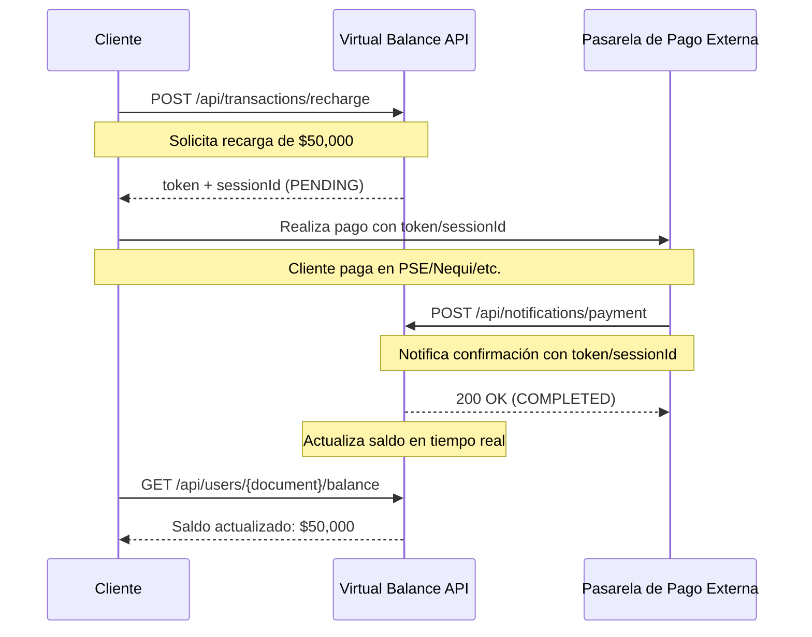

# 🔔 Webhook de Notificaciones de Pago

## 📋 Descripción General

Este documento describe el webhook de notificaciones de pago que permite a pasarelas externas (PSE, Nequi, Bancolombia, etc.) confirmar transacciones de recarga en tiempo real.

---

## 🎯 Endpoint

```
POST /api/notifications/payment
```

**URL Base (Producción):**
```
https://virtual-balance-api.onrender.com/api/notifications/payment
```

**URL Base (Desarrollo):**
```
http://localhost:8000/api/notifications/payment
```

---

## 🔐 Autenticación

El webhook requiere autenticación mediante API Key en el header:

```http
X-API-Key: your_api_key_here
```

⚠️ **Importante:** La API Key debe ser proporcionada por el equipo de Virtual Balance Backend.

---

## 📤 Request

### Headers Requeridos

| Header | Valor | Descripción |
|--------|-------|-------------|
| `Content-Type` | `application/json` | Formato de datos JSON |
| `X-API-Key` | `string` | API Key de autenticación |

### Body (JSON)

```json
{
  "token": "tok_507f1f77bcf86cd799439011",
  "sessionId": "sess_507f191e810c19729de860ea"
}
```

#### Parámetros

| Campo | Tipo | Requerido | Descripción |
|-------|------|-----------|-------------|
| `token` | string | ✅ Sí | Token único de la transacción (generado en el `/recharge`) |
| `sessionId` | string | ✅ Sí | ID de sesión de la transacción (generado en el `/recharge`) |

---

## 📥 Responses

### ✅ Pago Confirmado (200 OK)

La transacción fue procesada exitosamente y el saldo del usuario fue actualizado.

```json
{
  "success": true,
  "message": "Notificación de pago recibida y procesada exitosamente. Saldo actualizado.",
  "data": {
    "transaction_id": 1,
    "wallet_id": 1,
    "type": "RECHARGE",
    "amount": 50000.00,
    "status": "COMPLETED",
    "new_balance": 50000.00,
    "created_at": "2026-02-20 10:30:00",
    "updated_at": "2026-02-20 10:30:15"
  },
  "timestamp": "2026-02-20 10:30:15"
}
```

### ❌ Pago Fallido (400 Bad Request)

La notificación fue recibida pero la transacción fue marcada como fallida (simulación de rechazo por pasarela).

```json
{
  "success": false,
  "message": "Notificación recibida. La transacción fue marcada como fallida.",
  "data": {
    "transaction_id": 1,
    "wallet_id": 1,
    "type": "RECHARGE",
    "amount": 50000.00,
    "status": "FAILED",
    "created_at": "2026-02-20 10:30:00",
    "updated_at": "2026-02-20 10:30:15"
  },
  "timestamp": "2026-02-20 10:30:15"
}
```

### 🔍 Token Inválido (404 Not Found)

El token o sessionId proporcionado no existe en el sistema.

```json
{
  "success": false,
  "message": "Transacción no encontrada con el token y sessionId proporcionados",
  "timestamp": "2026-02-20 10:30:15"
}
```

### 🔒 API Key Inválida (401 Unauthorized)

La API Key proporcionada es inválida o no fue incluida en el header.

```json
{
  "success": false,
  "message": "API Key inválida o no proporcionada",
  "timestamp": "2026-02-20 10:30:15"
}
```

### ⚡ Datos Inválidos (400 Bad Request)

Los parámetros requeridos no fueron enviados o tienen formato inválido.

```json
{
  "success": false,
  "message": "El token y sessionId son obligatorios",
  "errors": [
    "Token es requerido",
    "SessionId es requerido"
  ],
  "timestamp": "2026-02-20 10:30:15"
}
```

---

## 🔄 Flujo Completo de Integración



---

## 📝 Ejemplo de Integración

### Paso 1: Cliente inicia recarga

```bash
curl -X POST https://virtual-balance-api.onrender.com/api/transactions/recharge \
  -H "Content-Type: application/json" \
  -H "X-API-Key: your_api_key" \
  -d '{
    "document": "1234567890",
    "phone": "3001234567",
    "amount": 50000
  }'
```

**Respuesta:**
```json
{
  "success": true,
  "data": {
    "transaction_id": 1,
    "token": "tok_507f1f77bcf86cd799439011",
    "sessionId": "sess_507f191e810c19729de860ea",
    "status": "PENDING"
  }
}
```

### Paso 2: Pasarela notifica confirmación

**La pasarela externa debe llamar a este endpoint cuando confirme el pago:**

```bash
curl -X POST https://virtual-balance-api.onrender.com/api/notifications/payment \
  -H "Content-Type: application/json" \
  -H "X-API-Key: your_api_key" \
  -d '{
    "token": "tok_507f1f77bcf86cd799439011",
    "sessionId": "sess_507f191e810c19729de860ea"
  }'
```

**Respuesta:**
```json
{
  "success": true,
  "message": "Notificación de pago recibida y procesada exitosamente. Saldo actualizado.",
  "data": {
    "transaction_id": 1,
    "status": "COMPLETED",
    "amount": 50000.00,
    "new_balance": 50000.00
  }
}
```

---

## 🔧 Configuración de Pasarelas

### Headers Personalizados

El webhook registra el `User-Agent` de la fuente para trazabilidad. Se recomienda que las pasarelas envíen un User-Agent identificable:

```http
User-Agent: PSE-Payment-Gateway/1.0
```

o

```http
User-Agent: Nequi-Webhook/2.5
```

### Retry Policy (Recomendado)

Si el webhook falla, se recomienda que las pasarelas implementen:

- **Reintentos:** 3 intentos
- **Backoff:** Exponencial (5s, 15s, 45s)
- **Timeout:** 30 segundos por intento

---

## 🧪 Testing

### Ambiente de Desarrollo

```bash
# Endpoint de desarrollo
BASE_URL="http://localhost:8000"
API_KEY="dev_api_key_12345"

# Test del webhook
curl -X POST "$BASE_URL/api/notifications/payment" \
  -H "Content-Type: application/json" \
  -H "X-API-Key: $API_KEY" \
  -d '{
    "token": "tok_ejemplo123",
    "sessionId": "sess_ejemplo456"
  }'
```

### Simulación de Respuestas

El sistema actualmente simula respuestas de pasarelas:
- **80% de éxito** (COMPLETED)
- **20% de fallo** (FAILED)

> ⚠️ **Nota:** En producción con pasarela real, este comportamiento se reemplazará por respuestas reales de la pasarela.

---

## 📊 Logging y Auditoría

Cada notificación recibida genera logs detallados:

```
[2026-02-20 10:30:15] INFO: Notificación de pago recibida
  token: tok_507f1f77bcf86cd799439011
  sessionId: sess_507f191e810c19729de860ea
  source: PSE-Payment-Gateway/1.0

[2026-02-20 10:30:15] INFO: Notificación de pago procesada
  transaction_id: 1
  status: COMPLETED
  amount: 50000.00
```

Esto permite:
- Auditoría completa de pagos
- Debugging de integraciones
- Trazabilidad de transacciones
- Detección de intentos fraudulentos

---

## ⚠️ Consideraciones de Seguridad

1. **API Key:** Nunca expongas la API Key públicamente
2. **HTTPS:** En producción, siempre usa HTTPS
3. **Validación:** El sistema valida que token/sessionId existan
4. **Idempotencia:** Múltiples notificaciones con el mismo token no procesan dos veces
5. **Rate Limiting:** (Próximamente) Límite de requests por IP/API Key

---

## 🤝 Soporte

Para configurar tu pasarela de pago con este webhook:

1. Solicita una API Key al equipo de Virtual Balance
2. Configura la URL del webhook en tu panel de pasarela
3. Realiza pruebas en ambiente de desarrollo
4. Valida en producción

---

## 🔄 Diferencia con `/api/transactions/confirm`

| Aspecto | `/transactions/confirm` | `/notifications/payment` |
|---------|------------------------|--------------------------|
| **Propósito** | Confirmación genérica | Webhook específico para pasarelas |
| **Llamado por** | Cliente o sistema | Pasarela externa |
| **Logging** | Básico | Detallado con User-Agent |
| **Contexto** | Cualquier confirmación | Solo notificaciones de pago |
| **Use Case** | Mismo (ConfirmPaymentUseCase) | Mismo (ConfirmPaymentUseCase) |

Ambos endpoints son válidos y funcionales. Usa `/notifications/payment` para integraciones con pasarelas externas.

---

**Versión del Documento:** 1.0.0  
**Fecha:** 2026-02-20  
**Sistema:** Virtual Balance Backend API
